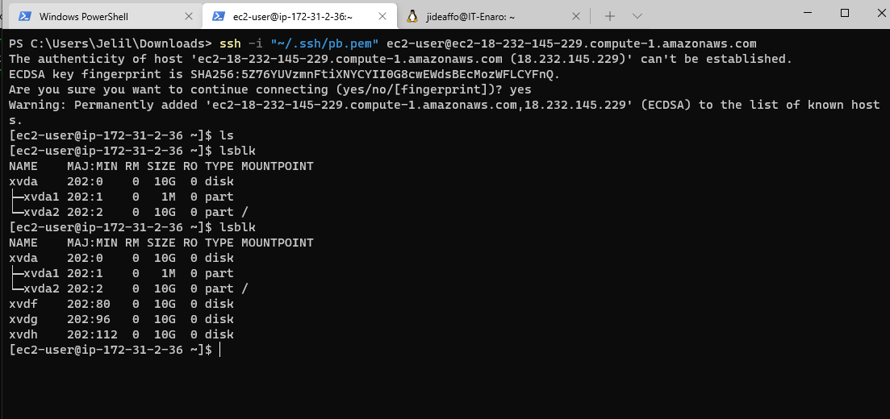
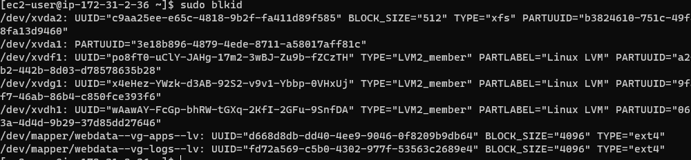

## 6: WEB SOLUTION WITH WORDPRESS
As a DevOps engineer you will most probably encounter PHP-based solutions since, even in 2021, it is the dominant web programming language used by more websites than any other programming language

In this project you will be tasked to prepare storage infrastructure on two Linux servers and implement a basic web solution using WordPress. WordPress is a free and open-source content management system written in PHP and paired with MySQL or MariaDB as its backend Relational Database Management System (RDBMS).

Project 6 consists of two parts:

Configure storage subsystem for Web and Database servers based on Linux OS. The focus of this part is to give you practical experience of working with disks, partitions and volumes in Linux.

Install WordPress and connect it to a remote MySQL database server. This part of the project will solidify your skills of deploying Web and DB tiers of Web solution.

As a DevOps engineer, your deep understanding of core components of web solutions and ability to troubleshoot them will play essential role in your further progress and development

Three-tier Architecture
Generally, web, or mobile solutions are implemented based on what is called the Three-tier Architecture.

Three-tier Architecture is a client-server software architecture pattern that comprise of 3 separate layers.

1.Presentation Layer (PL): This is the user interface such as the client server or browser on your laptop.
2.Business Layer (BL): This is the backend program that implements business logic. Application or Webserver
3.Data Access or Management Layer (DAL): This is the layer for computer data storage and data access. Database Server or File System Server such as FTP server, or NFS Server

In this project, you will have the hands-on experience that showcases Three-tier Architecture while also ensuring that the disks used to store files on the Linux servers are adequately partitioned and managed through programs such as gdisk and LVM respectively.

Your 3-Tier Setup
A Laptop or PC to serve as a client
An EC2 Linux Server as a web server (This is where you will install WordPress)
An EC2 Linux server as a database (DB) server

Use RedHat OS for this project

# Step 1 — Prepare a Web Server
Launch an EC2 instance that will serve as "Web Server". Create 3 volumes in the same AZ as your Web Server EC2, each of 10 GiB.

1. Attach all three volumes one by one to your Web Server EC2 instance

2. Use lsblk command to inspect what block devices are attached to the server. Notice names of your newly created devices. All devices in Linux reside in /dev/ directory. Inspect it with ls /dev/ and make sure you see all 3 newly created block devices there – their names will likely be xvdf, xvdh, xvdg.
3. Use df -h command to see all mounts and free space on your server

4. Use gdisk utility to create a single partition on each of the 3 disks

`sudo gdisk /dev/xvdf`

5. Use lsblk utility to view the newly configured partition on each of the 3 disks.

`lsblk`

6. Install lvm2 package using sudo yum install lvm2. Run sudo lvmdiskscan command to check for available partitions

`sudo yum install lvm2`

`which lvm`

Note: Previously, in Ubuntu we used apt command to install packages, in RedHat/CentOS a different package manager is used, so we shall use yum command instead

7. Use pvcreate utility to mark each of 3 disks as physical volumes (PVs) to be used by LVM

`sudo pvcreate /dev/xvdf1
sudo pvcreate /dev/xvdg1
sudo pvcreate /dev/xvdh1`

8. Verify that your Physical volume has been created successfully by running sudo pvs

9. Use vgcreate utility to add all 3 PVs to a volume group (VG). Name the VG webdata-vg

`sudo vgcreate webdata-vg /dev/xvdh1 /dev/xvdg1 /dev/xvdf1`

10. Verify that your VG has been created successfully by running sudo vgs

`sudo vgs`

11. Use lvcreate utility to create 2 logical volumes. apps-lv (Use half of the PV size), and logs-lv Use the remaining space of the PV size. NOTE: apps-lv will be used to store data for the Website while, logs-lv will be used to store data for logs.

`sudo lvcreate -n apps-lv -L 14G webdata-vg`

`sudo lvcreate -n logs-lv -L 14G webdata-vg`

12. Verify that your Logical Volume has been created successfully by running sudo lvs

`sudo lvs`

13. Verify the entire setup

`sudo vgdisplay -v #view complete setup - VG, PV, and LV`

`sudo lsblk`

14. Use mkfs.ext4 to format the logical volumes with ext4 filesystem

`sudo mkfs -t ext4 /dev/webdata-vg/apps-lv`

`sudo mkfs -t ext4 /dev/webdata-vg/logs-lv`

15. Create /var/www/html directory to store website files

`sudo mkdir -p /var/www/html`

16. Create /home/recovery/logs to store backup of log data

`sudo mkdir -p /home/recovery/logs`

17. Mount /var/www/html on apps-lv logical volume

18. Use rsync utility to backup all the files in the log directory /var/log into /home/recovery/logs (This is required before mounting the file system)

`sudo rsync -av /var/log/. /home/recovery/logs/`

19. Mount /var/log on logs-lv logical volume. (Note that all the existing data on /var/log will be deleted. That is why step 15 above is very important)

`sudo mount /dev/webdata-vg/logs-lv /var/log`

20. Restore log files back into /var/log directory

`sudo rsync -av /home/recovery/logs/. /var/log`

21. Update /etc/fstab file so that the mount configuration will persist after restart of the server.

UPDATE THE `/ETC/FSTAB` FILE
The UUID of the device will be used to update the /etc/fstab file;

`sudo blkid`

`sudo vi /etc/fstab`

1. Test the configuration and reload the daemon

`sudo mount -a`

`sudo systemctl daemon-reload`

2. Verify your setup by running df -h, output must look like this:

`df -h`

## Step 2 — Prepare the Database Server
Launch a second RedHat EC2 instance that will have a role – ‘DB Server’

Launch a second RedHat EC2 instance that will have a role – ‘DB Server’
Repeat the same steps as for the Web Server, but instead of apps-lv create db-lv and mount it to /db directory instead of /var/www/html/.

Create db-lv and mount it to /db directory

`sudo lvcreate -n db-lv -L 20G vg-database`

`sudo mkfs.ext4 /dev/vg-database/db-lv`

` sudo mount /dev/vg-database/db-lv /db`

`df -h`

Make the mount persistent

`sudo blkid`

`sudo vi /etc/fstab`

`sudo mount -a`

`sudo systemctl daemon-reload`

# Step 3 — Install WordPress on your Web Server EC2

1. Update the repository

`sudo yum -y update`

2. Install wget, Apache and it’s dependencies

`sudo yum -y install wget httpd php php-mysqlnd php-fpm php-json`

3. Start Apache

`sudo systemctl enable httpd
sudo systemctl start httpd`

4. To install PHP and it’s depemdencies

`sudo yum install https://dl.fedoraproject.org/pub/epel/epel-release-latest-8.noarch.rpm
sudo yum install yum-utils http://rpms.remirepo.net/enterprise/remi-release-8.rpm
sudo yum module list php
sudo yum module reset php
sudo yum module enable php:remi-7.4
sudo yum install php php-opcache php-gd php-curl php-mysqlnd
sudo systemctl start php-fpm
sudo systemctl enable php-fpm
setsebool -P httpd_execmem 1`

5. Restart Apache

`sudo systemctl restart httpd`

6. Download wordpress and copy wordpress to var/www/html

`mkdir wordpress
  cd   wordpress
  sudo wget http://wordpress.org/latest.tar.gz
  sudo tar xzvf latest.tar.gz
  sudo rm -rf latest.tar.gz
  cp wordpress/wp-config-sample.php wordpress/wp-config.php
  cp -R wordpress /var/www/html/`

  7. Configure SELinux Policies

  `sudo chown -R apache:apache /var/www/html/wordpress
  sudo chcon -t httpd_sys_rw_content_t /var/www/html/wordpress -R
  sudo setsebool -P httpd_can_network_connect=1`

  ## Step 4 — Install MySQL on your DB Server EC2

  `sudo yum update`

  `sudo yum install mysql-server`

 Verify that the service is up and running by using sudo systemctl status mysqld, if it is not running, restart the service and enable it so it will be running even after reboot:

  `sudo systemctl restart mysqld
sudo systemctl enable mysqld`

5. Step 5 — Configure DB to work with WordPress

`sudo mysql
CREATE DATABASE wordpress;
CREATE USER `myuser`@`<Web-Server-Private-IP-Address>` IDENTIFIED BY 'mypass';
GRANT ALL ON wordpress.* TO 'myuser'@'<Web-Server-Private-IP-Address>';
FLUSH PRIVILEGES;
SHOW DATABASES;
exit`

Step 6 — Configure WordPress to connect to remote database.
Hint: Do not forget to open MySQL port 3306 on DB Server EC2. For extra security, you shall allow access to the DB server ONLY from your Web Server’s IP address, so in the Inbound Rule configuration specify source as /32

1. Install MySQL client and test that you can connect from your Web Server to your DB server by using mysql-client

`sudo yum install mysql-server`

`sudo systemctl enable sqld`

 `sudo systemctl start sqld`

 `sudo systemctl status sqld`

sudo mysql -u admin -p -h <DB-Server-Private-IP-address>`

NOTE: edit security Group Inbound Rule to allow connection to Mysql/Aurora from the webserver local IP

Access the WebServer Through its public IP address

# Final Config on the Webserver

cd wordpress

sudo cp -R wordpress/. /var/www/html

We need to Update wp-config.
This information will include the db name, ip address of db host, db_user name and password

Install mysql server on the Webserver

`sudo yum install mysql-server`

